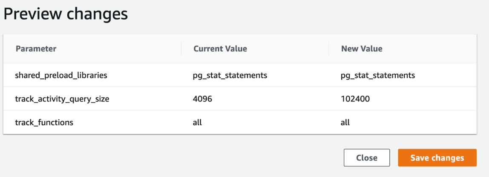

# PostgreSQL Performance Stats Snapper (PGSnapper)

Collecting database performance metrics is critical for troubleshooting any performance issues. AWS offers several services to gather and analyze database performance metrics, including [Amazon Relational Database Service](http://aws.amazon.com/rds) (Amazon RDS) Enhanced Monitoring, [Amazon CloudWatch](http://aws.amazon.com/cloudwatch), and [Amazon RDS Performance Insights](https://aws.amazon.com/rds/performance-insights/). While these services provide detailed insights on how your database is performing, sometimes you need a different analysis method to troubleshoot a specific database performance problem. Additionally, many database administrators like to use command line tools over a graphical user interface (GUI) to analyze database performance quickly and repeatedly.

Periodic metrics analysis is an analysis technique where you review the same set of metrics collected at consistent intervals over a period of time. This technique is helpful for comparing the behaviors of a database over an interval of time to see if there are opportunities to improve or maintain performance as the workload changes.

**PGSnapper** is an open-source tool that can assist with periodic collection (snapping) of [Amazon RDS for PostgreSQL](https://aws.amazon.com/rds/postgresql/) or [Amazon Aurora PostgreSQL-Compatible Edition](https://aws.amazon.com/rds/aurora/postgresql-features/) performance-related statistics and metrics. 

:warning: You must accept all the risks associated with production use of **PGSnapper** in regards to unknown/undesirable consequences. If you do not assume all the associated risks, you shouldn't be using this tool.

## Solution Overview


PGSnapper is written in Python. It uses a JSON config file that you can customize to include database dictionary views and queries, whose output you want to capture periodically. 

PGSnapper runs on an [Amazon Elastic Compute Cloud](http://aws.amazon.com/ec2) (Amazon EC2) instance with access to the PostgreSQL instance to be monitored. It retrieves database credentials stored in [AWS Secrets Manager](https://aws.amazon.com/secrets-manager/).PGSnapper then exports the monitored queries' output each time it runs and saves the output in separate CSV formatted files on the EC2 instance to have minimal impact on the database. When you're ready to analyze the output, you need to run a one-time packaging to collect other database stats and generate Data Definition Language (DDL) commands for creating the staging tables used for import **.** You can load the output generated by PGSnapper to any PostgreSQL database (for example, dev) using the Loader script included in the tool and perform analysis using the provided sample queries. You can also write your own custom SQL queries to analyze the output however you want.

The PGSnapper setup also creates an [Amazon Simple Storage Service](http://aws.amazon.com/s3) (Amazon S3) staging bucket that you can use for storing and sharing the PGSnapper-generated output with other teams.

## PGSnapper use cases

After PGSnapper is set up and scheduled to run periodically, you can use it for several different use cases, such as the following:

* Analyze database performance following a load test
* Dig deeper into database metrics to find the top resource-intensive queries if your database has a performance issue during a particular hour of the day
* Collect and share database performance metrics for your production database with another team, such as your performance engineering team, without giving them direct access to production

## Prerequisites

Complete the following prerequisite steps before setting up PGSnapper. Note that some of the DB parameters updated in this section are static and require an instance reboot to take effect. 

1. When you create a new RDS for PostgreSQL DB instance or Aurora PostgreSQL DB cluster, it comes with default parameter groups, which can't be updated. For RDS for PostgreSQL, create a [custom DB parameter group](https://docs.aws.amazon.com/AmazonRDS/latest/UserGuide/USER_WorkingWithParamGroups.html) and associate it with the RDS instance. For Aurora PostgreSQL, create a [custom cluster parameter group along with a custom DB parameter group](https://docs.aws.amazon.com/AmazonRDS/latest/AuroraUserGuide/USER_WorkingWithParamGroups.html). Associate the cluster parameter group with the Aurora cluster and the DB parameter group with the primary DB instance and the Aurora replicas.

2. Modify the [shared_preload_libraries](https://www.postgresql.org/docs/11/runtime-config-client.html) DB parameter and add **pg_stat_statements** extension if not already there. You can set this up in the DB parameter group for RDS for PostgreSQL and the cluster parameter group for Aurora PostgreSQL.

3. Modify the **track_functions** parameter and set to **all** to track procedural-language, SQL and C language functions. You can set this up in the DB parameter group for RDS for PostgreSQL and the cluster parameter group for Aurora PostgreSQL.

4. Set the **track_activity_query_size** parameter to **102400** to capture the full text of very long SQL statements. You can set this up in the DB parameter group for RDS for PostgreSQL and the cluster parameter group for Aurora PostgreSQL.

5. Verify and save the parameter updates.

    

6. Reboot the database instance. The **shared_preload_libraries** and **track_activity_query_size parameters** are static and require an instance reboot for them to take effect.

7. Create a database user which PGSnapper can use to connect to the PostgreSQL instance for collecting database metrics. You can use [psql](https://www.postgresql.org/docs/13/app-psql.html) or any PostgreSQL GUI client such as [pgAdmin](https://www.pgadmin.org/) for running the command below after updating the placeholder specified by **<>**.

	```bash
	/usr/local/pgsql/bin/psql --host=<RDS for PostgreSQL Endpoint / Aurora PostgreSQL cluster Endpoint> --port=<PostgreSQL Instance port e.g., 5432> --username=<RDS for PostgreSQL/ Aurora PostgreSQL cluster master username> --dbname=postgres
	
	create user pgsnapper password '<pasword>' in role pg_monitor;
	```

8. Load the **pg_stat_statements** extension into the PostgreSQL database, where application related objects are stored and which needs to be monitored, by running the following command.
 
	```bash
	/usr/local/pgsql/bin/psql --host=<RDS for PostgreSQL Endpoint / Aurora PostgreSQL cluster Endpoint> --port=<PostgreSQL Instance port e.g., 5432> --username=<RDS for PostgreSQL / Aurora PostgreSQL cluster master username> --dbname=<Database Name where Application objects are stored>

	postgres=> create extension pg_stat_statements;
	```

## Quick Start

The provided CloudFormation template completes the following setup steps in your AWS account:

* Stores the database user password in a Secrets Manager secret, which PGSnapper uses to connect to the PostgreSQL instance
* Creates an EC2 instance with the latest Amazon Linux 2 AMI and deploys it in the same VPC and Subnet as the PostgreSQL database instance.
* Bootstraps the EC2 instance by installing [AWS Systems Manager](https://aws.amazon.com/systems-manager/) agent, PostgreSQL Client, required Python packages and staging PGSnapper scripts.
* Creates an S3 bucket for storing and sharing PGSnapper-generated output
* Adds the security group for the EC2 instance to the security group assigned to the PostgreSQL instance for inbound network access.


1. Choose [](https://console.aws.amazon.com/cloudformation/home?#/stacks/create/review?stackName=pg-snapper&templateURL=https://auroraworkshopassets.s3-us-west-2.amazonaws.com/templates/pg-snapper/PG_Snapper.yml) to deploy the CloudFormation stack in your AWS account in the Region where the PostgreSQL instance to be monitored is running. 

2. The CloudFormation stack requires a few parameters, as shown in the following table. Enter the parameter values by referring their description.

| Parameter | Description |
| --- | --- |
| VPCID | VPC ID of PostgreSQL database instance (e.g., vpc-0343606e) to be monitored. |
| SubnetID | VPC Subnet ID of the PostgreSQL database instance (e.g., subnet-a0246dcd) to be monitored. |
| DBSecurityGroupID | Security Group ID of the PostgreSQL database instance (e.g., sg-8c14mg64) to be monitored. |
| InstanceType | PGSnapper EC2 instance type. Leave the default value. |
| EBSVolSize | PGSnapper EC2 instance EBS Volume Size in GiB. |
| DBUsername | Database user name for the PostgreSQL instance to be monitored e.g., pgsnapper |
| DBUserPassword | Database user password for the PostgreSQL instance to be monitored |
| DBPort | Port for the PostgreSQL Instance to be monitored. |

3. Select the acknowledgement check box and choose  **Create Stack**. Stack creation takes about 7 minutes to complete.

4. When it’s complete, choose the **Outputs** tab of the stack and note the resources that you need to configuring PGSnapper.

5. On the Amazon EC2 console, select the PGSnapper instance by referring to the value of the *PGSnapperEC2InstID* CloudFormation output key and choose **Connect**. On the **Session Manager** tab, choose **Connect** again.

6. Because Session Manager uses a user named **ssm-user** to connect to an EC2 instance by default, change to the user **ec2-user** by running the following command:

	```bash
	sudo su -l ec2-user
	```

7. Review PGSnapper usage by running the following command. 

	```bash
	[ec2-user@ip-172-31-14-11 ~]$ /home/ec2-user/scripts/pg_perf_stat_snapper.py -h
	
	usage: pg_perf_stat_snapper.py [-h] -e ENDPOINT -P PORT -d DBNAME -u USER -s
	                               SECRETARN -m MODE [-o OUTPUTDIR] -r REGION
	
	Snap PostgreSQL performance statistics and exit
	
	optional arguments:
	  -h, --help            show this help message and exit
	  -e ENDPOINT, --endpoint ENDPOINT
	                        PostgreSQL Instance Endpoint (default: None)
	  -P PORT, --port PORT  PostgreSQL Instance Port (default: None)
	  -d DBNAME, --dbname DBNAME
	                        Database Name where Application objects are stored
	                        (default: None)
	  -u USER, --user USER  Database UserName (default: None)
	  -s SECRETARN, --SecretARN SECRETARN
	                        AWS Secrets Manager stored Secret ARN (default: None)
	  -m MODE, --mode MODE  Mode in which the script will run: Specify either snap
	                        or package (default: None)
	  -o OUTPUTDIR, --outputdir OUTPUTDIR
	                        Output Directory (default:
	                        /home/ec2-user/scripts/output)
	  -r REGION, --region REGION
	                        AWS region (default: None)
	```

8. Run PGSnapper manually one time using the following command and review the log file generated under the "/home/ec2-user/scripts/log/\<ENDPOINT\>/\<DBNAME\>/" directory. By default, all the output is stored under the "/home/ec2-user/scripts/output/\<ENDPOINT\>/\<DBNAME\>/" directory. If you’re specifying the output directory using the -o argument, the path needs to be specified as an absolute path, for example /home/ec2-user/mysnapperoutput. 

    ```bash
	/home/ec2-user/scripts/pg_perf_stat_snapper.py -e <RDS for PostgreSQL Endpoint / Aurora PostgreSQL cluster Endpoint> -P <PostgreSQL Instance port e.g., 5432> -d <Database Name where Application objects are stored> -u <RDS for PostgreSQL / Aurora PostgreSQL cluster database username e.g. pgsnapper> -s <AWS Secretes Manager ARN. CloudFormation Output Key: PGSnapperSecretARN> -m snap -r <AWS region where you installed the CloudFormation stack e.g., us-west-2>
	```
    If you don't see any error in the log file, proceed to the next step. Otherwise, see the **Troubleshooting** section below for further troubleshooting.

    ```bash
	cat /home/ec2-user/scripts/log/<ENDPOINT>/<DBNAME>/pg_perf_stat_snapper.log
	```

9. Set up a crontab schedule in the EC2 instance to run PGSnapper every minute.

	```bash
	
	crontab -e

	# Press i to enter insert mode. Copy and paste the following after updating the placeholders in <>. Press Esc followed by :wq! to save & exit.
	
	*/1 * * * * /home/ec2-user/scripts/pg_perf_stat_snapper.py -e <RDS for PostgreSQL Endpoint / Aurora PostgreSQL cluster Endpoint> -P <PostgreSQL Instance port e.g., 5432> -d <Database name where application objects are stored> -u <RDS for PostgreSQL / Aurora PostgreSQL cluster database username e.g. pgsnapper> -s <AWS Secrets Manager ARN. CloudFormation Output Key: PGSnapperSecretARN> -m snap -r <AWS region where you installed the CloudFormation stack e.g., us-west-2> &>/dev/null
	```

## Load Test

1. (Optional) Discard all statistics gathered by pg_stat_statements before running load test by running the following:
	```bash
	/usr/local/pgsql/bin/psql --host=<RDS for PostgreSQL Endpoint / Aurora PostgreSQL cluster Endpoint> --port=<PostgreSQL Instance port e.g., 5432> --username=<RDS for PostgreSQL / Aurora PostgreSQL cluster master username> --dbname=<Database Name where Application objects are stored>

	postgres=> SELECT pg_stat_statements_reset();
	```
1. Perform Load test after PGSnapper is scheduled in crontab.

1. When the load test is complete, edit crontab and comment out PGSnapper schedule runs by adding # in front of the job. Press Esc followed by :wq! to save & exit. 

## Packaging the Output

PGSnapper packaging exports other database dictionary views and queries output mentioned in its config file, which are only required to be snapped once. It also generates a DDL command file named *all_ddls.sql*, which the Loader script described later, uses to create staging tables and import the output generated by PGSnapper.

1. Package PGSnapper output by running the following:
	```bash
	/home/ec2-user/scripts/pg_perf_stat_snapper.py -e <RDS for PostgreSQL Endpoint / Aurora PostgreSQL cluster Endpoint> -P <PostgreSQL Instance port e.g., 5432> -d <Database Name where Application objects are stored> -u <RDS for PostgreSQL / Aurora PostgreSQL cluster database username e.g. pgsnapper> -s <AWS Secretes Manager ARN. CloudFormation Output Key: PGSnapperSecretARN> -m package -r <AWS Region>
	```
    Verify that packaging was successful by viewing the PGSnapper logfile.
    ```bash
	cat /home/ec2-user/scripts/log/<ENDPOINT>/<DBNAME>/pg_perf_stat_snapper.log
	```
    
2. Zip the output and log directory, upload to the S3 bucket created by the CloudFormation Stack (CloudFormation Output Key: PGSnapperS3Bucket) and create a pre-signed URL of the zip file. In the example below ```s3://pg-snapper-output/``` is the bucket used for uploading the zip file.
	```bash
	cd /home/ec2-user/scripts
	zip -r pg-snapper-output output
	zip -r pg-snapper-output log
	aws s3 cp pg-snapper-output.zip s3://pg-snapper-output/
	aws s3 presign s3://pg-snapper-output/pg-snapper-output.zip --expires-in 604800
	```
3. Share the S3 URL with another team as needed, such as your performance engineering team, for loading PGSnapper output and perform further analysis.

## Troubleshooting

1. If you are seeing the error message "ERROR: Unexpected error: Couldn't connect to the PostgreSQL instance." while running PGSnapper, the stored password in AWS Secrets Manager secret might not be correct. You can view the password by going to [AWS Secrets Manager console](https://console.aws.amazon.com/secretsmanager/home?#/listSecrets), selecting the secret created by CloudFormation (CloudFormation Output Key: PGSnapperSecretARN) and selecting **Retrieve secret value**. Try to logon to the PostgreSQL database using the retrieved password as follows and see if you are able to connect to it. If the password is incorrect, you can edit the password stored in AWS Secrets Manager secret by selecting the **Edit** button on the same page.

    ```bash
	/usr/local/pgsql/bin/psql --host=<RDS for PostgreSQL Endpoint / Aurora PostgreSQL cluster Endpoint> --port=<PostgreSQL Instance port e.g., 5432> --username=<RDS for PostgreSQL / Aurora PostgreSQL cluster database username e.g. pgsnapper> --dbname=<Database Name where Application objects are stored>
	```

2. If you are seeing the error message "ERROR: Another instance of PGSnapper is already running for the same DBHOST and database. Exiting ..." while running PGSnapper, this means that another instance of PGSnapper is already running for the same PostgreSQL database or PGSnapper was terminated abnormally during the previous run. PGSnapper creates a hidden lock file under "/home/ec2-user/scripts/" sub-directory to make sure only one instance of PGSnapper is running at a time for a particular PostgreSQL database. The file name is in the format ".snapper_\<DBHOST\>_\<DBNAME\>.running". If PGSnapper was killed abnormally for some reason and the ".running" file was not deleted, you need to delete this file manually before you can re-run PGSnapper.

3. To debug any other issue with PGSnapper, review the log file stored under "/home/ec2-user/scripts/log/" sub-directory.

# PostgreSQL Performance Stats Loader

To load and analyze the metrics collected by PGSnapper, follow the steps below.

> **_NOTE:_** You can use the same EC2 instance for running PGSnapper and Loader Scripts. Also you can use the same PostgreSQL instance (where PGSnapper was executed earlier to collect database metrics) to load PGSnapper output. But as a best practice for production workloads, use a separate PostgreSQL instance to load PGSnapper output and perform your analysis.

## Setup

1. Create a database user in the PostgreSQL instance which PGSnapper will use to connect and load the collected metrics. You can use [psql](https://www.postgresql.org/docs/13/app-psql.html) or any PostgreSQL GUI client such as [pgAdmin](https://www.pgadmin.org/) for running the command below after updating the placeholder specified by **<>**.

```bash
/usr/local/pgsql/bin/psql --host=<RDS for PostgreSQL Endpoint / Aurora PostgreSQL cluster Endpoint> --port=<PostgreSQL Instance port e.g., 5432> --username=<RDS for PostgreSQL/ Aurora PostgreSQL cluster master username> --dbname=postgres
	
create user pgsnapper password '<pasword>' in role pg_monitor;
```

2. Create a new database to load PGSnapper-generated output by running the command below after updating the placeholder specified by **<>**.

```bash
/usr/local/pgsql/bin/psql --host=<RDS for PostgreSQL Endpoint / Aurora PostgreSQL cluster Endpoint> --port=<PostgreSQL Instance port e.g., 5432> --username=<RDS for PostgreSQL/ Aurora PostgreSQL cluster master username> --dbname=postgres
	
create database <database name e.g. testappsnaps>;
```

### Using a different EC2 instance for running Loader Scripts

Follow the [Quick Start](https://github.com/aws-samples/aurora-and-database-migration-labs/blob/master/Code/PGPerfStatsSnapper/README.md#quick-start) above if you want to use another EC2 instance for running the loader script and analyzing the results. During the CloudFormation stack setup, provide information for the PostgreSQL instance where you want to load PGSnapper generated output. Once the stack setup is complete, go to the **Import PGSnapper Output** section below.

### Using the same EC2 instance for running Loader Scripts

If you are using the same EC2 instance you used for PGSnapper, complete the following steps to use another PostgreSQL instance to load PGSnapper output. Once the stack setup is complete, go to the **Import PGSnapper Output** section below.

1. Store database database user credential of the PostgreSQL instance where the PGSnapper output will be loaded in [AWS secret manager](https://docs.aws.amazon.com/secretsmanager/latest/userguide/manage_create-basic-secret.html) and note down the secret ARN. This needs to be provided as the value of the argument **-s** while running the loader script to retrieve database credential for logging into the PostgreSQL instance.

1.  Select the IAM role assigned to the EC2 instance, expand the **secret-access-policy** Policy on the **Permissions** tab and click **Edit policy**. Click on **JSON** tab and modify the policy as follows specifying the AWS secretes managers secret ARNs for both the PostgreSQL instances.

	```
	{
		"Version": "2012-10-17",
		"Statement": [
			{
				"Action": [
					"secretsmanager:GetSecretValue"
				],
				"Resource": [
					"<Secret ARN 1>",
					"<Secret ARN 2>"
				],
				"Effect": "Allow"
			}
		]
	}
	```

## Import PGSnapper Output

1. If PGSnapper-generated output was shared with you using a pre-signed S3 URL, download it as follows:

	```bash
	cd /home/ec2-user/scripts
	curl "<S3 pre-signed URL>" -o snapper-output.zip
	unzip snapper-output.zip
	```

2. Import PGSnapper output by running the following command line. For the **-o** argument, provide the absolute path for the directory under which all the PGSnapper-generated CSV output files, including *all_ddls.sql* file, are stored. By default, this path is /home/ec2-user/scripts/output/\<ENDPOINT\>/\<DBNAME\>/.

   > **_NOTE:_** If you don't see **all_ddls.sql** in the same directory where all the PGSnapper related .csv output files are present, it means PGSnapper packaging was not run previously. Go back to [Packaging the Output](https://github.com/aws-samples/aurora-and-database-migration-labs/blob/master/Code/PGPerfStatsSnapper/README.md#packaging-the-output) section and follow the procedure. 

	```bash
	/home/ec2-user/scripts/pg_perf_stat_loader.py -e <RDS for PostgreSQL Endpoint / Aurora PostgreSQL cluster Endpoint> -P <PostgreSQL Instance port e.g., 5432> -d <Database name where PGSnapper-generated output will be imported e.g. testappsnaps> -u <RDS for PostgreSQL / Aurora PostgreSQL cluster database username e.g. pgsnapper> -s <AWS Secretes Manager ARN. CloudFormation Output Key: PGSnapperSecretARN> -o <Staged PGSnapper output directory> -r <AWS Region>
	```

	e.g.

	```bash
	/home/ec2-user/scripts/pg_perf_stat_loader.py -e aurorapg.cluster-xxxxxxxxxxx.us-west-2.rds.amazonaws.com -P 5432 -d testappsnaps -u pgsnapper -s arn:aws:secretsmanager:us-west-2:111111111111:secret:pgsnapper_secret-XbRXX -o /home/ec2-user/scripts/output/pgloadinst.cluster-xxxxxxxxxxxx.us-west-2.rds.amazonaws.com/testapp -r us-west-2
	```

3. Verify that the data loading was successful by viewing the loader script logfile /home/ec2-user/scripts/log/pg_perf_stat_loader.log.

	```bash
	cat /home/ec2-user/scripts/log/pg_perf_stat_loader.log
	```

# Uninstalling PGSnapper

To uninstall PGSnapper and delete related AWS resources, complete the following steps:

1. If you previously saved any data in the S3 bucket created by the PGSnapper CloudFormation stack (CloudFormation output key: PGSnapperS3Bucket), go to the Amazon S3 console and [empty that S3 bucket](https://docs.aws.amazon.com/AmazonS3/latest/userguide/empty-bucket.html).
2. On the AWS CloudFormation console, [delete](https://docs.aws.amazon.com/AWSCloudFormation/latest/UserGuide/cfn-console-delete-stack.html) the PGSnapper CloudFormation stack.

# Sample queries for PGSnapper Data Analysis

Sample queries for analyzing PGSnapper-generated output are available in [Github](https://github.com/aws-samples/aurora-and-database-migration-labs/tree/master/Code/PGPerfStatsSnapper/SQLs) including PostgreSQL instance and database-related stats, session stats, SQL stats, table stats, and index stats.

## Download SQL files for analysis

Download the SQL files to a machine where [psql](https://www.postgresql.org/docs/13/app-psql.html) is installed, and which has access to the PostgreSQL instance where you imported the PGSnapper-generated output. You can also use the PGSnapper EC2 instance for this purpose.

```bash
cd /home/ec2-user/scripts
svn checkout "https://github.com/aws-samples/aurora-and-database-migration-labs/trunk/Code/PGPerfStatsSnapper/SQLs"
```

## Run SQL queries for analysis

```bash
cd /home/ec2-user/scripts/SQLs

/usr/local/pgsql/bin/psql --host=<RDS for PostgreSQL Endpoint / Aurora PostgreSQL cluster Endpoint> --port=<PostgreSQL Instance port e.g., 5432> --username=<RDS for PostgreSQL / Aurora PostgreSQL cluster database username e.g. pgsnapper> --dbname=postgres --password

\l+

\c <database where PGSnapper data was imported>


=> \i snappermenu.sql
Pager usage is off.


==SNAPSHOT DETAILS==

list_snaps.sql                                          List snapshots available with time window


==SET SNAPSHOT WINDOW==

set_snaps.sql                                           Set Begin and End Snapshot ID for Analysis


==INSTANCE AND DATABASE STATS==

pg_version.sql                                          PostgreSQL engine version
db_and_schema_sizes.sql                                 Database and Schema Sizes
tables_and_indexes_by_tot_size.sql                      Top 20 Tables and Indexes by total Size
cache_hit_ratio.sql                                     Cache hit ratio in a time window
db_stats.sql                                            Database Level statistics in a time window
checkpoint_stats_by_snap_id.sql                         Checkpoints stats in a time window
temp_file_by_snap_id.sql                                Temp file stats by Snap ID
temp_table_cnt_by_snap_id.sql                           Temp tables count by Snap ID
installed_extensions.sql                                Installed PG extensions
pg_nd_params.sql                                        List Non-default parameters and see parameter details


==SESSION STATS==

session_cnt.sql                                         Total Sessions and Session count by state in a time window
session_activity_hist.sql                               Sessions activity with wait events in a time window
blockers_and_waiters_hist.sql                           Blocking and Waiting Sessions in a time window
vacuum_history.sql                                      Vacuum activity in a time window


==SQL STATS==

top_20_sqls_by_calls_v2.sql                             Top 20 queries by Executions/Calls in a time window
top_20_sqls_by_elapsed_time_v2.sql                      Top 20 queries by Elapsed time in a time window
top_10_sqls_by_cpu_by_snap_id_v2.sql                    Top 10 SQL queries by CPU by Snap ID
sql_stat_history_v2.sql                                 Execution trend of a query of interest in a time window
top_20_functions_by_avg_total_time.sql                  Top 20 functions by average total time in a time window


==TABLE STATS==

table_cols.sql                                          Details of Table columns
table_pk.sql                                            Details of Table Primary Key
table_fks.sql                                           Details of Foreign Keys referencing the Primary Key of the Parent Table
table_options.sql                                       Table Options for fill factor and Vacumming
top_20_tables_by_seq_scans.sql                          Top 20 Tables by number of Sequential or Full scans
top_20_tables_by_dmls.sql                               Top 20 Tables by DML activity
table_bloat.sql                                         Table Bloat Analysis
aging_tables_for_vacuum.sql                             Top 20 tables aged for Vacuum
sqls_touching_table.sql                                 List SQLs touching a table


==INDEX STATS==

indexes_on_table.sql                                    Indexes on a table
fks_with_no_index.sql                                   Foreign Keys with no Index
needed_indexes.sql                                      Needed Indexes
top_20_indexes_by_scans.sql                             Top 20 Indexes by number of Scans initiated in the index
top_20_indexes_by_avg_tuple_reads.sql                   TOP 20 Indexes by average Tuples Reads/Scan
unused_indexes.sql                                      Unused Indexes
duplicate_indexes.sql                                   Duplicate Indexes
index_bloat.sql                                         Index Bloat Analysis
```

List all the snapshots available with sample start and end times, that PGSnapper collected by running the following SQL file:

```bash
=> \i list_snaps.sql
```

Set the begin and end snapshot ID for analysis before running any of the analysis queries:

```bash
=> \i list_snaps.sql
=> \i set_snaps.sql
```

# Jupyter notebook for further exploration of PGSnapper collected data

A sample Jupyter notebook to analyze and plot graphs using PGSnapper collected data is available in [Github](https://github.com/aws-samples/aurora-and-database-migration-labs/tree/master/Code/PGPerfStatsSnapper/Juypter).

You can spin up a notebook instance using Amazon Sagemaker and import the sample .ipynb file to run the notebook and perform further analysis.


## License Summary

This sample code is made available under a modified MIT license. See the LICENSE file.
