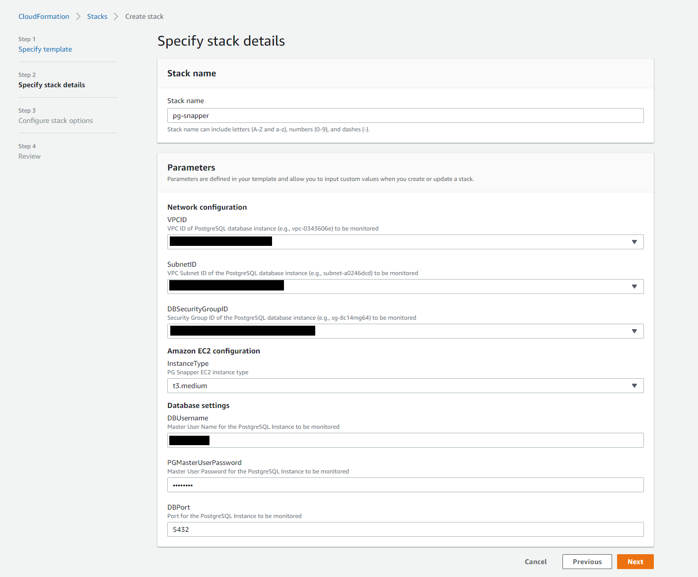
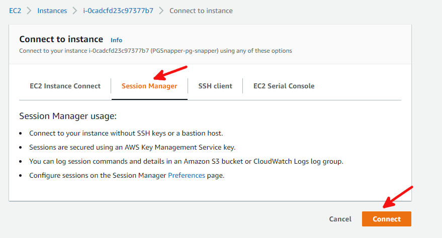

# PostgreSQL Performance Stats Snapper

While doing load testing on Amazon RDS/Aurora PostgreSQL for proof of concept (POC) or for testing the impact of any configuration or code change, its important to collect all the database performance related metrics periodically at a certain interval for post analysis.
RDS Enhanced Monitoring and RDS Performance Insights collect a lot of database performance metrics and provide dashboards for viewing the historical data. There are a lot of other database engine specific performance statistics and metrics, which can be collected to assist with deep dive analysis of performance problems post the load testing.

The snapper script provided here enables periodic collection (snapping) of PostgreSQL performance related statistics and metrics. The config file used by the script can be customized to add and remove database dictionary views and queries to be snapped as required.
The snapper script collects and stores the PostgreSQL database metrics in separate OS level files to have minimal impact on the database. These files can be loaded into another PostgreSQL instance by the loader script for analysis post the load testing.

:warning: You must accept all the risks associated with production use of the **Snapper** tool in regards to unknown/undesirable consequences. If you do not assume all the associated risk, you shouldn't be using this tool.

## Prerequisites

1. When you create a new RDS PostgreSQL database or Aurora PostgreSQL cluster, it comes with default parameter groups, which cannot be updated. If you haven't done it already, create a [custom DB parameter group](https://docs.aws.amazon.com/AmazonRDS/latest/UserGuide/USER_WorkingWithParamGroups.html) for RDS PostgreSQL and associate it with the RDS instance. For Aurora PostgreSQL, create a [custom cluster parameter group along with a custom DB parameter group](https://docs.aws.amazon.com/AmazonRDS/latest/AuroraUserGuide/USER_WorkingWithParamGroups.html). Associate the cluster parameter group with the Aurora cluster and the DB parameter group with the primary DB instance and the Aurora replicas.

1. Add **pg_stat_statements** and **aurora_stat_utils** extensions to [shared_preload_libraries](https://www.postgresql.org/docs/11/runtime-config-client.html) DB parameter and create required extensions by running the following in the PostgreSQL database where application related objects are stored. 
 
	**Note:**  ```aurora_stat_utils``` extension is valid only for Aurora PostgreSQL.
	```bash
	/usr/local/pgsql/bin/psql --host=<PostgreSQL Instance EndPoint> --port=<Port> --username=<Master UserName> --dbname=<Database Name where Application objects are stored>

	postgres=> create extension pg_stat_statements;
	postgres=> create extension aurora_stat_utils;
	```

1. Modify **track_functions** parameter and set to **all** to track procedural-language, SQL and C language functions. This can be set in DB Parameter group for RDS and Aurora.

1. Set **track_activity_query_size** parameter to the max value 102400 to capture the full text of very long SQL statements. This can be set in DB Parameter group for RDS and Cluster Parameter group for Aurora.


## Quick Start

1. Click [](https://console.aws.amazon.com/cloudformation/home?#/stacks/create/review?stackName=pg-snapper&templateURL=https://auroraworkshopassets.s3-us-west-2.amazonaws.com/templates/pg-snapper/PG_Snapper.yml) to deploy the CloudFormation stack in your AWS account in the region where the PostgreSQL instance to be monitored is running. The CloudFormation stack requires a few parameters, as shown in the following screenshot.



| Parameter | Description |
| --- | --- |
| VPCID | VPC ID of PostgreSQL database instance (e.g., vpc-0343606e) to be monitored |
| SubnetID | VPC Subnet ID of the PostgreSQL database instance (e.g., subnet-a0246dcd) to be monitored |
| DBSecurityGroupID | Security Group ID of the PostgreSQL database instance (e.g., sg-8c14mg64) to be monitored |
| InstanceType | PG Snapper EC2 instance type. Leave the default value |
| DBUsername | Master User Name for the PostgreSQL Instance to be monitored |
| PGMasterUserPassword | Master User Password for the PostgreSQL Instance to be monitored |
| DBPort | Port for the PostgreSQL Instance to be monitored |

The CloudFormation stack does the following setup in your AWS Account.
* Stores the database master password in an AWS Secrets Manager secret which Snapper uses to connect to the PostgreSQL instance.
* Creates an EC2 instance with the latest Amazon Linux 2 AMI and deploys it in the same VPC and Subnet as the PostgreSQL database instance.
* Bootstraps the EC2 instance by installing AWS Systems Manager(SSM) agent, PostgreSQL Client, required Python packages and staging the Snapper scripts.
* Creates an S3 bucket which you can use for storing and sharing Snapper output.
* Adds the security group for the EC2 instance to the security group assigned to the PostgreSQL instance for inbound network access.


2. Once the CloudFormation stack setup is complete, click the **Outputs** tab to note down the resources that you will need for running Snapper.

3. Select the EC2 instance (CloudFormation Output Key: EC2InstanceID) in EC2 Dashboard and click **Connect**. Click on **Session Manager** and click **Connect** again.



4. Session Manager uses ssm-user user to connect to the EC2 instance by default. Change user to **ec2-user** by running the following command:

	```bash
	sudo su -l ec2-user
	```

5. Review the Snapper script usage by running the following command. 

	```bash
	[ec2-user@ip-172-31-14-11 ~]$ /home/ec2-user/scripts/pg_perf_stat_snapper.py -h
	
	usage: pg_perf_stat_snapper.py [-h] -e ENDPOINT -P PORT -d DBNAME -u USER -s
								   SECRETARN -m MODE [-o OUTPUTDIR] -r REGION

	Snap PostgreSQL performance statistics and exit

	optional arguments:
	  -h, --help            show this help message and exit
	  -e ENDPOINT, --endpoint ENDPOINT
							PostgreSQL Instance Endpoint (default: None)
	  -P PORT, --port PORT  Port (default: None)
	  -d DBNAME, --dbname DBNAME
							Database Name where Application objects are stored
							(default: None)
	  -u USER, --user USER  Database UserName (default: None)
	  -s SECRETARN, --SecretARN SECRETARN
							AWS Secrets Manager stored Secret ARN (default: None)
	  -m MODE, --mode MODE  Mode in which the script will run: Specify either snap
							or package (default: None)
	  -o OUTPUTDIR, --outputdir OUTPUTDIR
							Output Directory (default:
							/home/ec2-user/scripts/output)
	  -r REGION, --region REGION
							AWS region (default: None)
	```

    Note that if you are specifying the output directory using the -o option, the path needs to be specified as an absolute path for e.g. /home/ec2-user/mysnapperoutput.

6. Run the Snapper script manually once using the following command and review the log file generated under "/home/ec2-user/scripts/log/" sub-directory. By default, all the output will be stored under "/home/ec2-user/scripts/output/" sub-directory. If you don't see any error in the log file, proceed to the next step. For further troubleshooting, see the **Troubleshooting** section below.

    ```bash
	/home/ec2-user/scripts/pg_perf_stat_snapper.py -e <PostgreSQL Instance EndPoint> -P <Port> -d <Database Name where Application objects are stored> -u <Master UserName> -s <AWS Secretes Manager ARN. Cloudformation Output Key: PGSnapperSecretARN> -m snap -r <AWS Region>
	```

7. Schedule the Snapper script in crontab to run every 1 minute. 

	```bash
	*/1 * * * * /home/ec2-user/scripts/pg_perf_stat_snapper.py -e <PostgreSQL Instance EndPoint> -P <Port> -d <Database Name where Application objects are stored> -u <Master UserName> -s <AWS Secretes Manager ARN. Cloudformation Output Key: PGSnapperSecretARN> -m snap -r <AWS Region>
	```

## Load Test

1. (Optional) Discard all statistics gathered by pg_stat_statements before running load test by running the following:
	```bash
	/usr/local/pgsql/bin/psql --host=<PostgreSQL Instance EndPoint> --port=<Port> --username=<Master UserName> --dbname=<Database Name where Application objects are stored>

	postgres=> SELECT pg_stat_statements_reset();
	```
1. Perform Load test after the snapper script is scheduled in crontab.

1. Once load test is complete, comment out crontab to disable the snapper scheduled runs.

## Packaging the Output

1. Package the snapper output by running the following:
	```bash
	/home/ec2-user/scripts/pg_perf_stat_snapper.py -e <PostgreSQL Instance EndPoint> -P <Port> -d <Database Name where Application objects are stored> -u <Master UserName> -s <AWS Secretes Manager ARN. Cloudformation Output Key: PGSnapperSecretARN> -m package -r <AWS Region>
	```
2. Zip the output and log directory, upload to the S3 bucket created by the CloudFormation Stack (CloudFormation Output Key: SnapperS3Bucket) and create a pre-signed URL of the zip file. In the example below ```s3://pg-snapper-output/``` is the bucket used for uploading the zip file.
	```bash
	cd /home/ec2-user/scripts
	zip -r pg-snapper-output output
	zip -r pg-snapper-output log
	aws s3 cp pg-snapper-output.zip s3://pg-snapper-output/
	aws s3 presign s3://pg-snapper-output/pg-snapper-output.zip --expires-in 604800
	```
3. Share the S3 URL for loading the output and do further analysis.

## Troubleshooting

1. If you are seeing the error message "ERROR: Unexpected error: Couldn't connect to the PostgreSQL instance." while running Snapper, the stored password in AWS Secrets Manager secret might not be correct. You can view the password by going to [AWS Secrets Manager console](https://console.aws.amazon.com/secretsmanager/home?#/listSecrets), selecting the secret created by CloudFormation (CloudFormation Output Key: PGSnapperSecretARN) and selecting **Retrieve secret value**. Try to logon to the PostgreSQL database using the retrieved password as follows and see if you are able to connect to it. If the password is incorrect, you can edit the password stored in AWS Secrets Manager secret by selecting the **Edit** button on the same page.

    ```bash
	/usr/local/pgsql/bin/psql --host=<PostgreSQL Instance EndPoint> --port=<Port> --username=<Master UserName> --dbname=<Database Name where Application objects are stored>
	```

2. If you are seeing the error message "ERROR: Another instance of snapper is already running for the same DBHOST and database. Exiting ..." while running Snapper, this means that another instance of snapper is already running for the same PostgreSQL database or Snapper was terminated abnormally during the previous run. Snapper creates a hidden file under "/home/ec2-user/scripts/" sub-directory to make sure only one instance of Snapper is running at a time for a particular PostgreSQL database. The file name is in the format ".snapper_\<DBHOST\>_\<DBNAME\>.running". If snapper was killed abnormally for some reason and the ".running" file was not deleted, you need to delete this file manually before you can re-run Snapper.

3. To debug any other issue with snapper, review the log file stored under "/home/ec2-user/scripts/log/" sub-directory.

# PostgreSQL Performance Stats Loader

To load and analyze the metrics collected by Snapper, follow the steps below.

> **_NOTE:_** You can use the same EC2 instance for running Snapper and Loader Scripts.

## Setup

Follow the Quick Start above if you want to use another EC2 instance for running the loader script and analyzing the results. During the CloudFormation stack setup, provide information for the PostgreSQL instance where you want to load the Snapper output. Once the stack setup is complete, go to the **Import Snapper Output** section below.

If you are using the same EC2 instance you used for Snapper, complete the following steps to use another PostgreSQL instance to load Snapper output and analyze the results.

1. Store database master credential of the PostgreSQL instance where the snapper output will be loaded in [AWS secret manager](https://docs.aws.amazon.com/secretsmanager/latest/userguide/manage_create-basic-secret.html) and note down the secret ARN. This needs to be provided as a parameter to the loader script to retrieve database credential for logging into the PostgreSQL instance.

1.  Select the IAM role assigned to the EC2 instance, expand the **secret-access-policy** Policy on the **Permissions** tab and click **Edit policy**. Click on **JSON** tab and modify the policy as follows specifying the AWS secretes managers secret ARNs for both the PostgreSQL instances.

	```
	{
		"Version": "2012-10-17",
		"Statement": [
			{
				"Action": [
					"secretsmanager:GetSecretValue"
				],
				"Resource": [
					"<Secret ARN 1>",
					"<Secret ARN 2>"
				],
				"Effect": "Allow"
			}
		]
	}
	```

## Import Snapper Output

1. Download the snapper outputs from the provided pre-signed S3 URL.

	```bash
	cd /home/ec2-user/scripts
	curl "<S3 pre-signed URL>" -o snapper-output.zip
	unzip snapper-output.zip
	```

2. Import the snapper output by running the following:

	```bash
	/home/ec2-user/scripts/pg_perf_stat_loader.py -e <PostgreSQL Instance EndPoint> -P <Port> -d postgres -u <Master UserName> -s <AWS Secretes Manager ARN. Cloudformation Output Key: PGSnapperSecretARN> -o <Staged snapper output directory> -r <AWS Region>
	```

	For e.g.

	```bash
	/home/ec2-user/scripts/pg_perf_stat_loader.py -e aurorapg.cluster-xxxxxxxxxxx.us-east-1.rds.amazonaws.com -P 5432 -d postgres -u masteruser -s arn:aws:secretsmanager:us-east-1:111111111111:secret:masteruser_secret-XbRXX -o /home/ec2-user/scripts/output/pgloadinst.cluster-xxxxxxxxxxxx.us-east-1.rds.amazonaws.com/postgres -r us-east-1
	```

# Uninstalling Snapper

To uninstall Snapper and delete related AWS resources, follow the steps below.

1. Remove the inbound rule created for the Snapper EC2 host's security group (CloudFormation Logical ID: ```Ec2SecurityGroup```) from the target database's security group (```DBSecurityGroupID``` parameter value which you entered during setting up the stack) by going to [AWS EC2 console](https://console.aws.amazon.com/ec2/home?#SecurityGroups:).

2. Delete the Snapper CloudFormation Stack by going to [AWS CloudFormation console](https://console.aws.amazon.com/cloudformation/home?#/stacks?filteringStatus=active&filteringText=&viewNested=true&hideStacks=false).

# Sample queries for Snapper Data Analysis

Sample queries for snapper data analysis is available in [Github](https://github.com/aws-samples/aurora-and-database-migration-labs/tree/master/Code/PGPerfStatsSnapper/SQLs).

## Download SQL files for analysis

Download the SQLs to a machine where PSQL is installed and which has access to the PostgreSQL instance where snapper data was uploaded.

```bash
cd /home/ec2-user/scripts
svn checkout "https://github.com/aws-samples/aurora-and-database-migration-labs/trunk/Code/PGPerfStatsSnapper/SQLs"
```

## Run SQL queries for analysis

```bash
cd /home/ec2-user/scripts/SQLs

/usr/local/pgsql/bin/psql --host=<endpoint> --port=<port> --username=<username> --dbname=postgres --password

\l+

\c <database where snapper data is stored>


postgres=> \i snappermenu.sql
Pager usage is off.

==SNAPSHOT DETAILS==

list_snaps.sql                                          List snapshots available with time window


==SET SNAPSHOT WINDOW==

set_snaps.sql                                           Set Begin and End Snapshot ID for Analysis


==INSTANCE AND DATABASE STATS==

db_and_schema_sizes.sql                                 Database and Schema Sizes
tables_and_indexes_tot_size.sql                         Top 20 Tables and Indexes by total Size
cache_hit_ratio.sql                                     Cache hit ratio in a time window
db_stats.sql                                            Database Level statistics in a time window
checkpoint_stats_by_snap_id.sql                         Checkpoints stats in a time window
temp_file_by_snap_id.sql                                Temp file stats by Snap ID
temp_table_cnt_by_snap_id.sql                           Temp tables count by Snap ID


==SESSION STATS==

session_cnt.sql                                         Total Sessions and Session count by state in a time window
session_activity_hist.sql                               Sessions activity with wait events in a time window
blockers_and_waiters_hist.sql                           Blocking and Waiting Sessions in a time window
vacuum_history.sql                                      Vacuum activity in a time window


==SQL STATS==

top_20_sqls_by_calls.sql                                Top 20 queries by Executions/Calls in a time window
top_20_sqls_by_elapsed_time.sql                         Top 20 queries by Elapsed time in a time window
top_10_sqls_by_cpu_by_snap_id.sql                       Top 10 SQL queries by CPU by Snap ID
sql_stat_history.sql                                    Execution trend of a query of interest in a time window


==TABLE STATS==

table_cols.sql                                          Details of Table columns
table_pk.sql                                            Details of Table Primary Key
table_fks.sql                                           Details of Foreign Keys referencing the Primary Key of the Parent Table
top_20_tables_by_seq_scans.sql                          Top 20 Tables by number of Sequential or Full scans
top_20_tables_by_dmls.sql                               Top 20 Tables by DML activity
table_bloat.sql                                         Table Bloat Analysis
sqls_touching_table.sql                                 List SQLs touching a table


==INDEX STATS==

indexes_on_table.sql                                    Indexes on a table
fks_with_no_index.sql                                   Foreign Keys with no Index
needed_indexes.sql                                      Needed Indexes
top_20_indexes_by_scans.sql                             Top 20 Indexes by number of Scans initiated in the index
top_20_indexes_by_avg_tuple_reads.sql                   TOP 20 Indexes by average Tuples Reads/Scan
unused_indexes.sql                                      Unused Indexes
duplicate_indexes.sql                                   Duplicate Indexes
index_bloat.sql                                         Index Bloat Analysis

postgres=>
```

Set Begin and End Snapshot ID for Analysis before running the analysis queries:

```bash
=> \i list_snaps.sql
=> \i set_snaps.sql
```

# Jupyter notebook for further exploration of snapper collected data

A sample Jupyter notebook to analyze and plot graphs using snapper collected data is available in [Github](https://github.com/aws-samples/aurora-and-database-migration-labs/tree/master/Code/PGPerfStatsSnapper/Juypter).

You can spin up a notebook instance using Amazon Sagemaker and import the sample .ipynb file to run the notebook and do further analysis.


## License Summary

This sample code is made available under a modified MIT license. See the LICENSE file.
